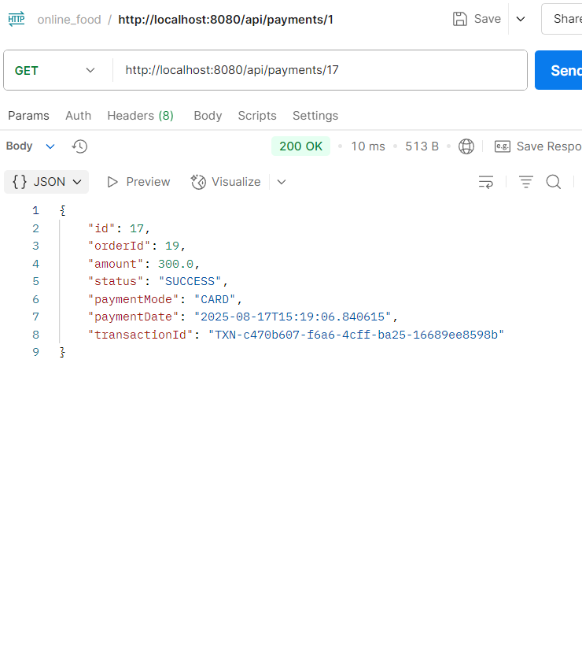

# Online Food Ordering System

A Java-based web application developed in Eclipse IDE that allows restaurants to manage online orders, track order status, handle customer feedback, and process payments.

---

## Installation

1. Clone the repository:
   ```bash
   git clone https://github.com/your-username/online-food-ordering-system.git
   ```

2. Open **Eclipse IDE**.
3. Go to:

   ```
   File → Import → Existing Projects into Workspace
   ```
4. Select the cloned project folder.
5. Click **Finish** – the project will be imported into Eclipse.
6. Right-click the project → **Run As → Java Application**.
7. The application will start at:

   ```
   http://localhost:8080
   ```

---

## Modules and Dependencies

* Spring Boot – Core application framework  
* Spring Security – Authentication & authorization  
* MySQL / H2 – Database  
* JDBC / Hibernate / JPA – Database interaction  
* JUnit – Testing framework  
* Log4j / SLF4J – Logging

---

## Features

* User registration and login  
* Menu management (add, update, delete items)  
* Order placement and tracking  
* Cart and checkout system  
* Payment integration  
* Customer feedback handling  
* Error logging and system monitoring

---

## API Endpoints

### Authentication

- **POST** `/auth/register` → Register a new user  
  

- **POST** `/auth/login` → Login with username & password  
  

---

### Cart

- **POST** `/cart` → Add item to cart  
  

- **GET** `/cart/{userId}` → Get all cart items for a user  
  

- **GET** `/cart/details/{userId}` → Get cart details (with menu item info)  
  

- **DELETE** `/cart/{id}` → Delete a cart item by id  
  

- **DELETE** `/cart/clear/{userId}` → Clear all cart items for a user  
  

- **POST** `/cart/checkout` → Checkout and place an order  
  Params: `userId`, `paymentMode`, `deliveryAddress`  
  

---

### Menu

- **POST** `/menu` → Add new menu item *(Admin only)*  
  

- **PUT** `/menu/{id}` → Update a menu item *(Admin only)*  
  

- **DELETE** `/menu/{id}` → Delete a menu item *(Admin only)*  
  

- **GET** `/menu` → Fetch all menu items  
  

- **GET** `/menu/{id}` → Fetch single menu item by id  
  

---

### Orders

- **POST** `/orders/place` → Place a new order  
  Params: `userId`, `paymentMode`, `deliveryAddress`  
  

- **GET** `/orders/user/{userId}` → Get all orders for a user  
  

- **GET** `/orders/{orderId}` → Get details of a specific order  
  

- **PUT** `/orders/{id}/status?status=DELIVERED` → Update order status  
  

---

### Payments

- **POST** `/api/payments/{orderId}?paymentMode=CARD` → Pay for an order  
  

- **GET** `/api/payments/order/{orderId}` → Get payments by order id  
  

- **GET** `/api/payments/{id}` → Get payment by id  
  

---

All APIs return `JSON` responses.  
Protected endpoints (`/menu` for example) require **ADMIN role**.

---

## Testing

This project uses **JUnit** for unit and integration testing.  
Run the tests in Eclipse:

```
Right-click Project → Run As → JUnit Test
```

---

## Logging and Error Handling

* Uses **Log4j / SLF4J** for error logging.  
* Records system errors and transaction logs.

---

## Deployment

* Push the project to GitHub using Eclipse or Git CLI.  
* To run on a server (Tomcat/Jetty), export the project as a WAR file and deploy.  
* For production, configure **MySQL** instead of H2 (in `application.properties`).
